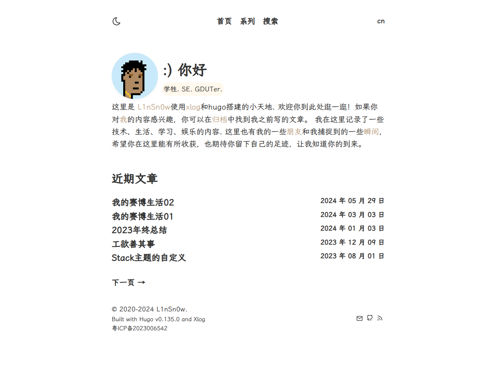

# Xlog

Xlog is a clean and minimal Hugo theme based on [Minima](https://mivinci.github.io/hugo-theme-minima) . Check out the [example site](https://le0.me/hugo-theme-minima/).

[demo site](https://log.linsnow.cn)



> Note that the main branch is in development phase, UI or configuration may vary.


## Features

- [x] 🌗 Dark mode
- [x] 📚 Multilingual support
- [x] 🎨 Highly customizable
- [x] 🏳️‍🌈 Syntax highlighting - VSCode Dark+
- [x] 🔢 Mathematical expressions - KaTeX
- [x] 💹 Diagrams and flowcharts - Mermaid
- [x] 🧑‍💻 Comment systems - Waline, Twikoo, Artalk, Disqus, Utterances, Giscus
- [x] 🔎 Site search - FuseJS
- [x] 📈 Google Analytics integration
- [x] 🔗 External link support
- [x] ✉️ RSS feed generation
- [x] ⚡️ Fast loading speed
- [x] 🔒 High stability and reliability
- [x] 📄 Multiple single page support (including About, Gallery, Links)
- [x] 📜 Shortcode support (including fullscreen)
- [x] 🖼️ Excellent image display support

## Usage

Before using Xlog, make sure you've got Hugo (extended version) installed on your device.

### Installation

You can use either `git submodule` or `git clone` to fetch this theme into the directory where Hugo places themes.

#### Git Clone

```bash
git clone https://github.com/lin-snow/hugo-theme-xlog.git themes/xlog
```


### Configuration

Follow [exampleSite/config.yaml](https://github.com/lin-snow/hugo-theme-xlog/blob/main/exampleSite/config.yaml) and edit your own one.

## Supported Front Matters

| Attr       | Type   | Explanation |
|:----------- |:------ |:------------|
| title       | string | title |
| description | string | description |
| date        | string | creation time |
| categories  | array<string>  | category list |
| series      | array<string>  | series list |
| tags        | array<string>  | tag list |
| math        | bool   | enables math plugin |
| diagram     | bool   | enables diagram plugin |
| comment     | bool   | enable comment plugin |
| draft       | bool   | disallow being published |
| link        | string | a URL to redirect to |

## Feedback

Feedbacks are welcome [here](https://github.com/lin-snow/hugo-theme-xlog/issues).

## Star History

[](https://star-history.com/#star-history/star-history&Date)

## License

Hugo Minima is MIT licensed.
